# `ccproxy` - Claude Code Proxy

[](https://github.com/starbased-co/ccproxy)

`ccproxy` unlocks the full potential of your Claude MAX subscription by enabling Claude Code to seamlessly use unlimited Claude models alongside other LLM providers like OpenAI, Gemini, and Perplexity.

It works by intercepting Claude Code's requests through a [LiteLLM Proxy Server](https://docs.litellm.ai/docs/simple_proxy), allowing you to route different types of requests to the most suitable model - keep your unlimited Claude for standard coding, send large contexts to Gemini's 2M token window, route web searches to Perplexity, all while Claude Code thinks it's talking to the standard API.

- **Complete Cross-Provider Caching Support** is coming soon. **Note**: Claude Code doesn't explicitly cache tool definitions; Anthropic's backend automatically handles this when Claude Code-specific headers are detected in requests. Based on my research, all proxy/router projects on GitHub suffer the same inefficiency. Carefully monitor tool definition token usage while using non-Anthropic providers.

> ⚠️ **Note**: This is a newly released project ready for public use and feedback. While core functionality is complete, real-world testing and community input are welcomed. Please [open an issue](https://github.com/starbased-co/ccproxy/issues) to share your experience, report bugs, or suggest improvements.

## Installation

```bash
# Recommended: install as a uv tool
uv tool install git+https://github.com/starbased-co/ccproxy.git

# Alternative: Install with pip
pip install git+https://github.com/starbased-co/ccproxy.git
```

## Usage

Run the automated setup:

```bash
# This will create all necessary configuration files in ~/.ccproxy
ccproxy install

tree ~/.ccproxy
# ~/.ccproxy
# ├── ccproxy.py
# ├── ccproxy.yaml
# └── config.yaml

# Start the proxy server
ccproxy start --detach

# Start Claude Code
ccproxy run claude
# Or add to your .zshrc/.bashrc
export ANTHROPIC_BASE_URL="http://localhost:4000"
# Or use an alias
alias claude-proxy='ANTHROPIC_BASE_URL="http://localhost:4000" claude'
```

Congrats, you have installed `ccproxy`! The installed configuration files are intended to be a simple demonstration, thus continuing on to the next section to configure `ccproxy` is **recommended**.

### Configuration

#### `ccproxy.yaml`

This file controls how `ccproxy` hooks into your Claude Code requests and how to route them to different LLM models based on rules. Here you specify rules, their evaluation order, and criteria like token count, model type, or tool usage.

```yaml
ccproxy:
  debug: true
  hooks:
    - ccproxy.hooks.rule_evaluator # evaluates rules against request 󰁎─┬─ (optional, needed for
    - ccproxy.hooks.model_router # routes to appropriate model       󰁎─┘  rules & routing)
    - ccproxy.hooks.forward_oauth # required for claude code's oauth token
  rules:
    # example rules
    - name: token_count
      rule: ccproxy.rules.TokenCountRule
      params:
        - threshold: 60000
    - name: web_search
      rule: ccproxy.rules.MatchToolRule
      params:
        - tool_name: WebSearch
    # basic rules
    - name: background
      rule: ccproxy.rules.MatchModelRule
      params:
        - model_name: claude-3-5-haiku-20241022
    - name: think
      rule: ccproxy.rules.ThinkingRule

litellm:
  host: 127.0.0.1
  port: 4000
  num_workers: 4
  debug: true
  detailed_debug: true
```

When `ccproxy` receives a request from Claude Code, the `rule_evaluator` hook labels the request with the first matching rule:

1. `MatchModelRule`: A request with `model: claude-3-5-haiku-20241022` is labeled: `background`
2. `ThinkingRule`: A request with `thinking: {enabled: true}` is labeled: `think`

If a request doesn't match any rule, it receives the `default` label.

#### `config.yaml`

[LiteLLM's proxy configuration file](https://docs.litellm.ai/docs/proxy/config_settings) is where your model deployments are defined. The `model_router` hook takes advantage of [LiteLLM's model alias feature](https://docs.litellm.ai/docs/completion/model_alias) to dynamically rewrite the model field in requests based on rule criteria before LiteLLM selects a deployment. When a request is labeled (e.g., think), the hook changes the model from whatever Claude Code requested to the corresponding alias, allowing seamless redirection to different models.

The diagram shows how routing labels (⚡ default, 🧠 think, 🍃 background) map to their corresponding model deployments:

```mermaid
graph LR
    subgraph ccproxy_yaml["<code>ccproxy.yaml</code>"]
        R1["<div style='text-align:left'><code>rules:</code><br/><code>- name: default</code><br/><code>- name: think</code><br/><code>- name: background</code></div>"]
    end

    subgraph config_yaml["<code>config.yaml</code>"]
        subgraph aliases[" "]
            A1["<div style='text-align:left'><code>model_name: default</code><br/><code>litellm_params:</code><br/><code>&nbsp;&nbsp;model: claude-sonnet-4-20250514</code></div>"]
            A2["<div style='text-align:left'><code>model_name: think</code><br/><code>litellm_params:</code><br/><code>&nbsp;&nbsp;model: claude-opus-4-1-20250805</code></div>"]
            A3["<div style='text-align:left'><code>model_name: background</code><br/><code>litellm_params:</code><br/><code>&nbsp;&nbsp;model: claude-3-5-haiku-20241022</code></div>"]
        end

        subgraph models[" "]
            M1["<div style='text-align:left'><code>model_name: claude-sonnet-4-20250514</code><br/><code>litellm_params:</code><br/><code>&nbsp;&nbsp;model: anthropic/claude-sonnet-4-20250514</code></div>"]
            M2["<div style='text-align:left'><code>model_name: claude-opus-4-1-20250805</code><br/><code>litellm_params:</code><br/><code>&nbsp;&nbsp;model: anthropic/claude-opus-4-1-20250805</code></div>"]
            M3["<div style='text-align:left'><code>model_name: claude-3-5-haiku-20241022</code><br/><code>litellm_params:</code><br/><code>&nbsp;&nbsp;model: anthropic/claude-3-5-haiku-20241022</code></div>"]
        end
    end

    R1 ==>|"⚡ <code>default</code>"| A1
    R1 ==>|"🧠 <code>think</code>"| A2
    R1 ==>|"🍃 <code>background</code>"| A3

    A1 -->|"<code>alias</code>"| M1
    A2 -->|"<code>alias</code>"| M2
    A3 -->|"<code>alias</code>"| M3

    style R1 fill:#e6f3ff,stroke:#4a90e2,stroke-width:2px,color:#000

    style A1 fill:#fffbf0,stroke:#ffa500,stroke-width:2px,color:#000
    style A2 fill:#fff0f5,stroke:#ff1493,stroke-width:2px,color:#000
    style A3 fill:#f0fff0,stroke:#32cd32,stroke-width:2px,color:#000

    style M1 fill:#f8f9fa,stroke:#6c757d,stroke-width:1px,color:#000
    style M2 fill:#f8f9fa,stroke:#6c757d,stroke-width:1px,color:#000
    style M3 fill:#f8f9fa,stroke:#6c757d,stroke-width:1px,color:#000

    style aliases fill:#f0f8ff,stroke:#333,stroke-width:1px
    style models fill:#f5f5f5,stroke:#333,stroke-width:1px
    style ccproxy_yaml fill:#e8f4fd,stroke:#2196F3,stroke-width:2px
    style config_yaml fill:#ffffff,stroke:#333,stroke-width:2px
```



And the corresponding `config.yaml`:

```yaml
# config.yaml
model_list:
  # aliases here are used to select a deployment below
  - model_name: default
    litellm_params:
      model: claude-sonnet-4-20250514

  - model_name: think
    litellm_params:
      model: claude-opus-4-1-20250805

  - model_name: background
    litellm_params:
      model: claude-3-5-haiku-20241022

  # deployments
  - model_name: claude-sonnet-4-20250514
    litellm_params:
      model: anthropic/claude-sonnet-4-20250514
      api_base: https://api.anthropic.com

  - model_name: claude-opus-4-1-20250805
    litellm_params:
      model: anthropic/claude-opus-4-1-20250805
      api_base: https://api.anthropic.com

  - model_name: claude-3-5-haiku-20241022
    litellm_params:
      model: anthropic/claude-3-5-haiku-20241022
      api_base: https://api.anthropic.com

litellm_settings:
  callbacks:
    - ccproxy.handler
general_settings:
  forward_client_headers_to_llm_api: true
```

See [docs/configuration.md](docs/configuration.md) for more information on how to customize your Claude Code experience using `ccproxy`.

<!-- ## Extended Thinking -->

<!-- Normally, when you send a message, Claude Code does a simple keyword scan for words/phrases like "think deeply" to determine whether or not to enable thinking, as well the size of the thinking token budget. [Simply including the word "ultrathink](https://claudelog.com/mechanics/ultrathink-plus-plus/) sets the thinking token budget to the maximum of `31999`. -->

## Hooks & Rules

## Hooks

### Rules

`ccproxy` provides several built-in rules as an homage to [claude-code-router](https://github.com/musistudio/claude-code-router):

- **MatchModelRule**: Routes based on the requested model name
- **ThinkingRule**: Routes requests containing a "thinking" field
- **TokenCountRule**: Routes requests with large token counts
- **MatchToolRule**: Routes based on tool usage (e.g., WebSearch)

See [`rules.py`](src/ccproxy/rules.py) for implementing your own rules.

Custom rules (and hooks) are loaded with the same mechanism that LiteLLM uses to import the custom callbacks, that is, they are imported by the LiteLLM python process as named module from within it's virtual environment (e.g. `import custom_rule_file.custom_rule_function`), or as a python script adjacent to `config.yaml`.

## CLI Commands

`ccproxy` provides several commands for managing the proxy server:

```bash
# Install configuration files
ccproxy install [--force]

# Start LiteLLM
ccproxy start [--detach]

# Stop LiteLLM
ccproxy stop

# Check that the proxy server is working
ccproxy status

# View proxy server logs
ccproxy logs [-f] [-n LINES]

# Run any command with proxy environment variables
ccproxy run <command> [args...]

```

After installation and setup, you can run any command through the `ccproxy`:

```bash
# Run Claude Code through the proxy
ccproxy run claude --version
ccproxy run claude -p "Explain quantum computing"

# Run other tools through the proxy
ccproxy run curl http://localhost:4000/health
ccproxy run python my_script.py

```

The `ccproxy run` command sets up the following environment variables:

- `ANTHROPIC_BASE_URL` - For Anthropic SDK compatibility
- `OPENAI_API_BASE` - For OpenAI SDK compatibility
- `OPENAI_BASE_URL` - For OpenAI SDK compatibility

## Contributing

I welcome contributions! Please see the [Contributing Guide](CONTRIBUTING.md) for details on:

- Reporting issues and asking questions
- Setting up development environment
- Code style and testing requirements
- Submitting pull requests

Since this is a new project, I especially appreciate:

- Bug reports and feedback
- Documentation improvements
- Test coverage additions
- Feature suggestions
- Any of your implementations using `ccproxy`
